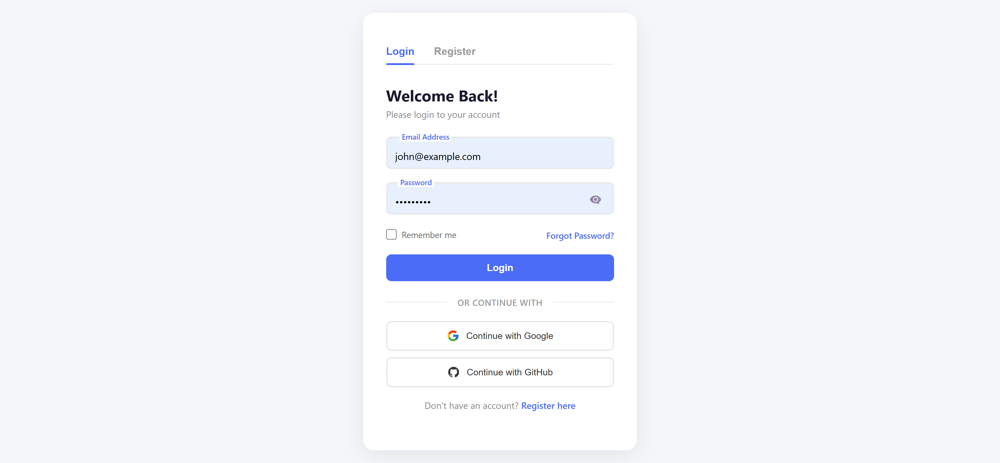

# React Authentication System

A complete, professional authentication system built with React, React Hook Form, Yup validation, and React Router.

## ✨ Features

- 🔐 **Login & Registration** with real-time validation
- 🎨 **Floating Labels** with smooth CSS animations
- 👁️ **Password Visibility Toggle** for better UX
- 📊 **Password Strength Indicator** with real-time feedback
- 🔑 **Forgot Password Modal** with email verification
- 🌐 **Social Login Buttons** (Google, GitHub)
- 💬 **Toast Notifications** for user feedback
- 🎯 **Form Persistence** with localStorage
- 🛡️ **Protected Routes** for authenticated pages
- 📱 **Fully Responsive** design
- 🏗️ **Professional Folder Structure** for scalability

## 📸 Screenshots



## 🚀 Tech Stack

- React
- React Hook Form
- Yup (Validation)
- React Router
- React Toastify
- CSS3

## 📁 Project Structure

```
Signup-Form/
│
├── src/
│   ├── components/
│   │   ├── common/
│   │   │   └── PasswordInput/
│   │   │       ├── PasswordInput.css
│   │   │       └── PasswordInput.jsx
│   │   │
│   │   └── auth/
│   │       ├── ForgotPassword/
│   │       │   ├── ForgotPassword.css
│   │       │   └── ForgotPassword.jsx
│   │       │
│   │       └── SocialLogin/
│   │           ├── SocialLogin.css
│   │           └── SocialLogin.jsx
│   │
│   ├── pages/
│   │   ├── LoginPage/
│   │   │   ├── LoginPage.css
│   │   │   └── LoginPage.jsx
│   │   │
│   │   ├── RegisterPage/
│   │   │   ├── RegisterPage.css
│   │   │   └── RegisterPage.jsx
│   │   │
│   │   └── DashboardPage/
│   │       ├── DashboardPage.css
│   │       └── DashboardPage.jsx
│   │
│   ├── layouts/
│   │   ├── AuthLayout/
│   │   │   ├── AuthLayout.css
│   │   │   └── AuthLayout.jsx
│   │   │
│   │   └── DashboardLayout/
│   │       ├── DashboardLayout.css
│   │       └── DashboardLayout.jsx
│   │
│   ├── context/
│   │   └── AuthContext.jsx
│   │
│   ├── hooks/
│   │   ├── useAuth.js
│   │   └── useFormPersistence.js
│   │
│   ├── services/
│   │   └── api.js
│   │
│   ├── utils/
│   │   └── validation.js
│   │
│   ├── App.css
│   ├── App.jsx
│   ├── index.css
│   └── main.jsx
│
├── public/
│   └── vite.svg
│
├── .gitignore
├── eslint.config.js
├── index.html
├── package.json
├── package-lock.json
├── README.md
└── vite.config.js
```

## 📂 Folder Structure Explained

| Folder | Purpose |
|--------|---------|
| `components/common/` | Reusable UI components used across the app (PasswordInput) |
| `components/auth/` | Authentication-specific components (ForgotPassword, SocialLogin) |
| `pages/` | Complete page components (Login, Register, Dashboard) |
| `layouts/` | Layout wrappers for different sections (AuthLayout, DashboardLayout) |
| `context/` | React Context providers (Authentication state) |
| `hooks/` | Custom React hooks for reusable logic |
| `services/` | API service functions for backend communication |
| `utils/` | Utility functions (validation schemas, helpers) |

## 🛠️ Installation

```bash
# Clone the repository
git clone https://github.com/raiteju/react-form-hook.git
cd react-form-hook

# Install dependencies
npm install

# Start development server
npm run dev

# Open in browser
http://localhost:5173
```

## 📖 Usage Guide

### 🔐 Authentication Flow

#### Register
1. Enter full name, email, and password
2. Password requirements:
   - Minimum 6 characters
   - At least one uppercase letter
   - At least one lowercase letter
   - At least one number
3. Password strength indicator shows real-time feedback
4. Click "Register" to create account
5. Success screen appears with "Login Now" button

#### Login
1. Enter registered email and password
2. Click "Remember me" to persist your email
3. Click "Forgot Password" to reset your password
4. Click "Login" to access your dashboard

#### Dashboard (Protected)
1. Personalized greeting based on time of day
2. User profile information displayed
3. Dashboard cards for future features
4. Click "Logout" to return to login

### 🔑 Test Credentials

```
Email: test@example.com
Password: Password@123
```

## 🎨 Customization

### Change Primary Color

Update `#4a6cf7` to your brand color in all CSS files:

```css
background: #4a6cf7;
border-color: #4a6cf7;
color: #4a6cf7;
accent-color: #4a6cf7;
```

### Update Validation Rules

Modify `src/utils/validation.js`:

```javascript
password: yup
  .string()
  .min(8, 'Password must be at least 8 characters')
  .matches(/^(?=.*[A-Z])/, 'Must contain uppercase')
  .matches(/^(?=.*[a-z])/, 'Must contain lowercase')
  .matches(/^(?=.*[0-9])/, 'Must contain number')
  .matches(/^(?=.*[!@#$%^&*])/, 'Must contain special character')
  .required('Password is required')
```

### Add Social Login Providers

Update `src/components/auth/SocialLogin/SocialLogin.jsx`:

```javascript
const handleSocialLogin = (provider) => {
  // Redirect to OAuth endpoint
  if (provider === 'Google') {
    window.location.href = '/auth/google';
  } else if (provider === 'GitHub') {
    window.location.href = '/auth/github';
  }
};
```

### Update API Endpoints

Modify `src/services/api.js`:

```javascript
const API_URL = 'https://your-api.com/api';

export const authService = {
  login: async (credentials) => {
    const response = await axios.post(`${API_URL}/login`, credentials);
    return response.data;
  },
  // ... other methods
};
```

## 📱 Responsive Design

| Device | Breakpoint | Layout |
|--------|-----------|--------|
| Desktop | > 768px | Full layout with max-width 420px |
| Tablet | 481px - 768px | Adjusted padding and font sizes |
| Mobile | < 480px | Single column, optimized inputs |

## 🤝 Contributing

1. Fork the repository
2. Create your feature branch:
   ```bash
   git checkout -b feature/AmazingFeature
   ```
3. Commit your changes:
   ```bash
   git commit -m 'Add some AmazingFeature'
   ```
4. Push to the branch:
   ```bash
   git push origin feature/AmazingFeature
   ```
5. Open a Pull Request

## 📄 License

MIT License - see [LICENSE](LICENSE) file for details.

## 🙏 Acknowledgments

- [React Hook Form](https://react-hook-form.com/)
- [Yup](https://github.com/jquense/yup)
- [React Router](https://reactrouter.com/)
- [React Toastify](https://fkhadra.github.io/react-toastify/)
- [Vite](https://vitejs.dev/)

## 📞 Contact

Your Name - [@yourtwitter](https://twitter.com/yourtwitter) - email@example.com

Project Link: [https://github.com/raiteju/react-form-hook](https://github.com/raiteju/react-form-hook)

---

## ⭐ Show Your Support

If you found this project helpful, please give it a ⭐ on GitHub!